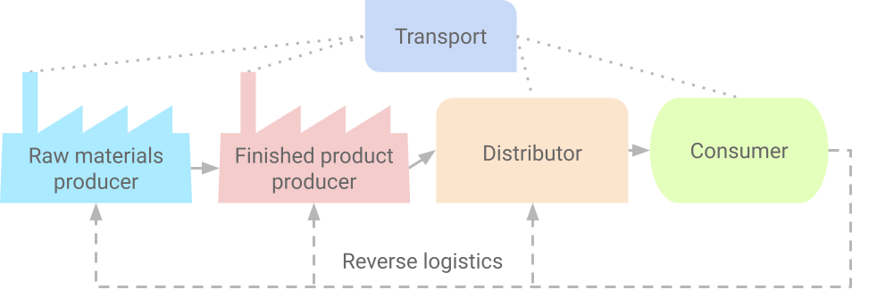

# The basics of supply chains
Versions: text - [pdf](https://docs.google.com/document/d/1hrMALYhcYkFCPh2f6sow9qVebdjmW94UtoQs0hHgEIk/export?format=pdf)  [html](https://docs.google.com/document/d/e/2PACX-1vRejwtoNfAjTSonmnHvp6Ed_57n0xstdjC-gV3oN6Z2qruNBrJ5O4J8nnTZulpCn6C-1TLq5mdWtYGJ/pub)  [gdoc](https://docs.google.com/document/d/1hrMALYhcYkFCPh2f6sow9qVebdjmW94UtoQs0hHgEIk/edit?usp=sharing)

Main objectives:
* Understanding supply chain objectives and the impact of supply chain decisions on the business results;
* Identifying the main phases of decision-making inside supply chains. Clear out the importance of each phase;
* Identifying the main processes and groups of processes in supply chains.
Keywords: supply chain profitability, supply chain elements, supply chain decisions, supply chain processes

## Introduction, aim and objectives of the course
*"Supply chain management is a set of approaches used to effectively integrate suppliers, manufacturers, processing centers, and warehouses so that these goods are produced and delivered in precise quantities at optimal places and times to minimize system-wide costs and to ensure service level requirements are met.*” David Simchi-Levi, 2003

Supply chains consist of all organizations involved directly or indirectly in fulfilling the requirements of end customers. A supply chain does not only consist of a manufacturer and a supplier, but also includes organizations involved in transportation, warehousing, retailing, as well as the customers themselves. Within any organization—for example, a manufacturer—the supply chain includes all functions involved in fulfilling customer orders. These include new product development, marketing, manufacturing, distribution, finance and customer service.
In a supply chain, a manufacturer receives materials from several different suppliers and in turn supplies finished products to various distributors. Most supply chains are actually supply networks, an example diagram is shown in the following figure:

*Figure 2. A simple supply chain structure*

### Main tasks
Supply chain management focuses on automation and optimization of logistics operations throughout the product life cycle, performing the following tasks and functions:
* Supplier relationship management - search for suitable suppliers, evaluation, procurement, cost management;
* Management of relationships with distributors - design, construction of distribution channels, control over fulfillment of requests;
* Warehousing - stock control, rules for storing goods (often called SKUs or stock-keeping units, "names kept in stock");
* Forecasting - of the consumption of materials and consumables, of production demand, preparation of requests for purchases and production;
* Pricing - accurate assessment of logistics costs, assessment of added value
* Distribution - selection and distribution of means of transport and routes, positioning of warehouses, workshops;
* Optimization - reduction of logistics costs (transportation, storage), acceleration of logistics processes;
* Integration - analysis of internal and external material and information flows, research into the possibilities of combining efforts with partners.

*Figure 3. Complex integration of the elements in the supply chains*

Key drivers of supply chain performance.
* Facilities - warehouses, workshops, terminals
* Stocks - finished products, blanks, materials, consumables
* Transport - roads, vehicles, transport schemes
* Information - documentation, databases and knowledge bases, methods for analysis and decision-making, ready-made software products
* Pricing - Cost Analysis
* Procurement - supplier relationships, inventory control, supply optimization

## Efficiency of supply chains
MDV - effective integration of resource providers, production, warehouses, stores so that manufactured goods are delivered to end users with minimal costs of the entire system and satisfies customer needs and requirements.

Table 1. Six Target Indicators for Evaluating Supply Chain Performance
| Pointer | Purpose (to be delivered...) | Indicators | 
| --- | --- | --- |
| Product | the required product | nomenclature scope, specific products, product customization | 
| Quantity | quantity required | indicators of availability, level of service, possibility of wholesale and retail supplies | 
| Quality | with an established level of quality | certificates, integrated quality control systems | 
| Place | in the right place | territorial scope, positioning, exclusive access to the strategic resource | 
| Time | at the right time | delivery frequency, response time | 
| Expenses | with minimal costs | total costs, distribution of costs in the chain | 

### Product:
* Assortment (how many SKUs it manages)
* Variety (how many types of products it manages - with different requirements)
* What special characteristics do the products have (expiry date, dangerous, valuable, ...)
* Relationships between products (kits, ecosystem)
* Coverage of complex needs (the limits of the spectrum of services)
* Uniqueness of each item - customization - mass production
* Product/assortment renewal cycle

### Quantity:
* Capacity (how many customers we can serve)
* Flexibility (no minimum order quantities)

### Quality:
* Quality certificates
* Stability of quality
* Service quality

### Place:
* Number of commercial establishments in the country
* Dislocation in key locations
* Average distance to object

### Time:
* Delivery/Service Time
* Time management of inquiries
* Frequency and rhythmicity of deliveries

### Cost:
* Price range
* Price stability
* Payment terms

### Example:
Compare the efficiency of the following circuits (Ikea and Jysk):

Image sources: IKEA - [https://en.m.wikipedia.org/wiki/file:Ikea_logo.svg](https://en.m.wikipedia.org/wiki/File:Ikea_logo.svg);
Jysk - [https://en.m.wikipedia.org/wiki/File:Jysk_logo.svg](https://en.m.wikipedia.org/wiki/File:Jysk_logo.svg);

## Conflicts of interests between the participants in the SC
Partners may have conflicting interests that place their relationships in a competitive context. Their interrelationships are complex because their purpose must involve finding the appropriate balance between competition and cooperation. Through their connectivity, the members of the chain create conditions for each of them to concentrate on increasing the value for the end customer and reducing the time and costs of its creation.

## Information system and coordination of material flows in a logistics chain
A logistics chain (LC) is a group of business entities linked by commercial contracts for joint activity with the aim of delivering goods and services to the end customer according to his requirements. The contract may be verbal. If there is no trade contract - no logistics chain - these are random transactions, not a logistics system.
In this system of organizations, two levels are distinguished:
* exchange links between participants
* the production system in which resources are used and developed.
Exchange relationships coordinate and direct activities in the production system where resources are used, combined and transformed into output. Due to the pooling of resources, coordination between actors is necessary to realize savings, but also to create innovative changes.

Main Logistics Operations:
* Preparation of goods for transport and warehouse operations.
* Grouping, consolidation.
* Cargo and unloading activity
* Domestic transport activities
Logistics services - forwarding, cargo insurance, customs service, building a distribution network and a network for the removal of waste products.

## Importance of supply chains for the Bulgarian economy
Factors affecting the economy of Bulgaria in the context of the organization of delivery processes:
* In Bulgaria, low-value goods are sold on foreign markets (EU, USA) with relatively high transport costs.
* The price of raw materials is constantly rising.
* The price of energy carriers is constantly increasing
* Bulgarian markets for raw materials and goods are becoming more and more distant.

## Additional reading:
1. M. Rakovska. Supply chain management - a factor for competitiveness. Railway transport magazine. (*М. Раковска. Управление на веригата на доставките - фактор за конкурентоспособността. Списание Железопътен транспорт* [original](https://www.jptactis.com/Archives/jpt605/rakovska.htm), [archive](https://docs.google.com/document/d/1zgWwAFSpffqATbABh2kdds_1YG7wT4wYWB3v-CZDmQM/preview))
2. M. Rakovska. Theoretical aspects of supply chain management. 2009. Scientific works UNSS (*М. Раковска. Теоретични аспекти на управлението на веригата на доставките. 2009. Научни трудове УНСС* [original](https://www.unwe.bg/uploads/ResearchPapers/Research%20Papers_vol2_2009_No6_M%20Rakovska.pdf), [archive](https://drive.google.com/file/d/1OYRbHhzJSLpP5eelu6DzqpRBaElB50WI/view?usp=sharing))
