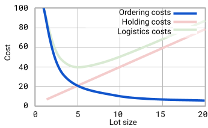
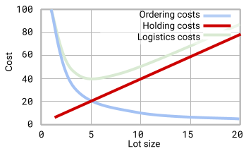
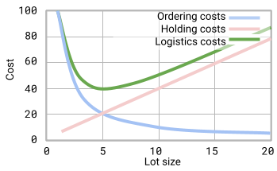
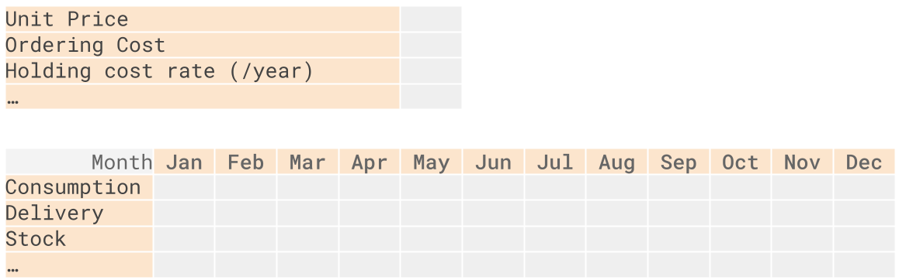
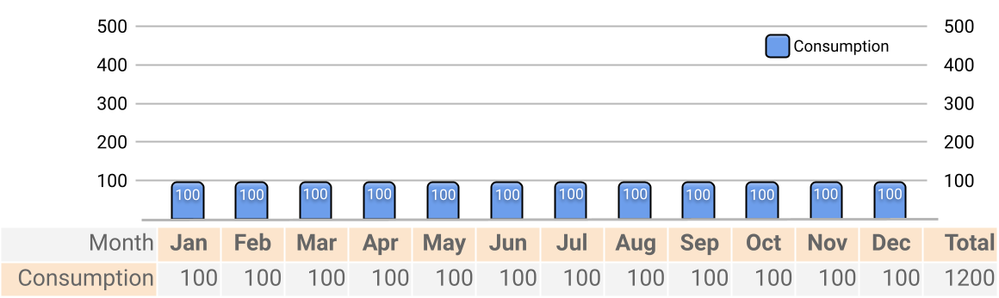
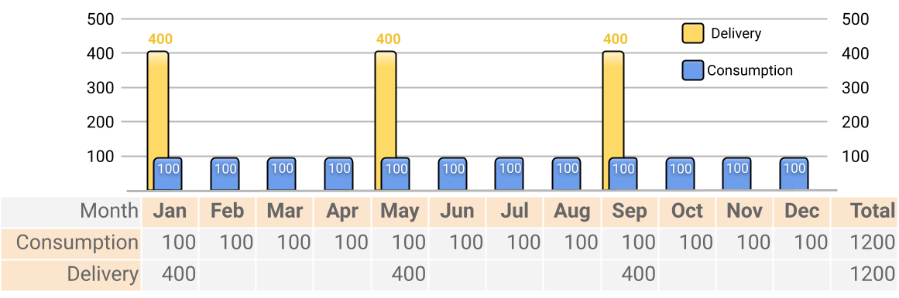
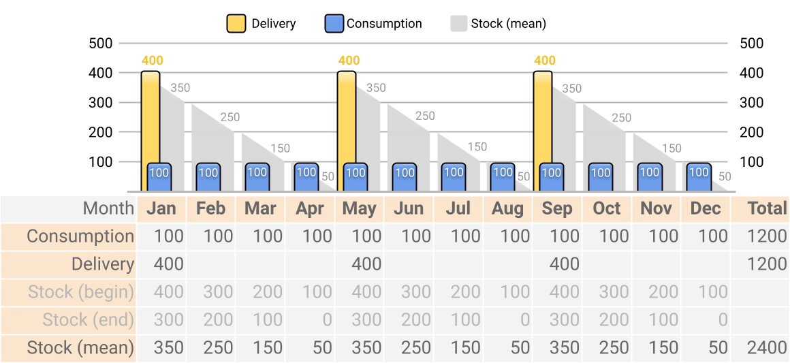
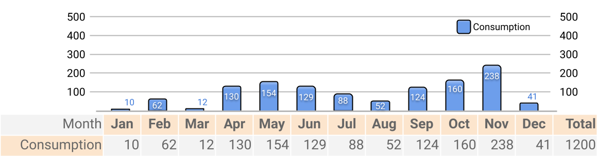
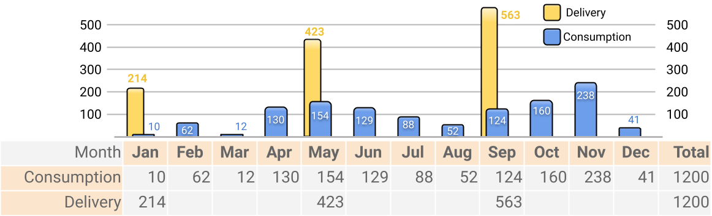
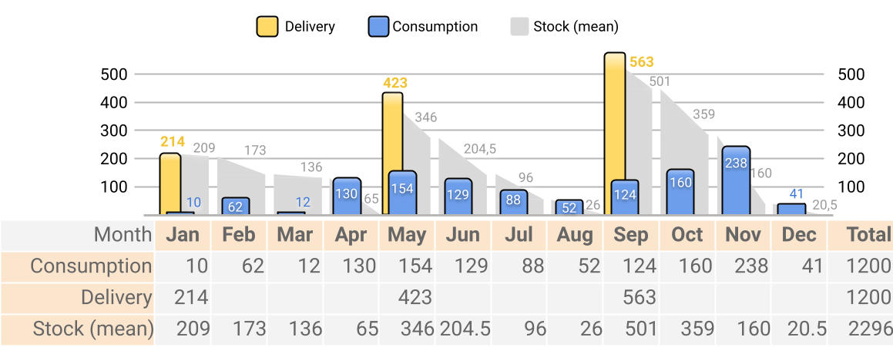

# Inventory cost planning. Logistics costs

Versions: notes - [pdf](https://github.com/IgorBG/SCM/blob/main/source/lectures/logistics_costs/logistic_costs.pdf), [html](https://github.com/IgorBG/SCM/blob/main/source/lectures/logistics_costs/logistic_costs.html), [source](https://github.com/IgorBG/SCM/blob/main/source/lectures/logistics_costs/logistic_costs.md)

Cost management in SKU inventory management; Modeling of material supplies at constant consumption level; Modeling supply under variable consumption

Keywords: stock keeping unit (SKU); ordering cost, holding cost, logistics cost

Dynamic stock management models are used in information systems (ERP, WMS, IMS) supporting and automating the work of the supply department, warehouse, transport and others. Supply modeling can include running a simulation, forecasting consumption, estimating costs. In this lecture we will focus on cost estimation. Thus, the models we use show what costs are expected for one or another procurement option.

The symbols we use in formulas:

A - Standard cost of one delivery

r - Rate of holding cost

D - Consumption of SKUs for the period or Quantity of SKUs purchased

V - The unit price of SKU

Q(i) - The current stock level in the warehouse (as of time/month i)

Q(ord) - Lot size purchased

Q(min) - Minimum planned stock. Usually Q(min) = safety stock or balance in the warehouse at the end of the period.

Q(max) - Maximum planned stock. Usually Q(max) = minimum planned stock + delivery quantity

## Determination of SCM inventory management costs

Looking at the structure of the total costs of supplying a business unit with SKU, a few significant feathers stand out: the company buys SKU, then it must provide the means to deliver these materials to its warehouse, and finally cover the cost of their stay in its warehouse . In the same logic, we distinguish between main components of costs related to inventory management:

- Cost of acquisition of SKU;

- Fixed costs for the execution of the order;

- Holding cost.

*Figure 1. Components of inventory operational costs*

**Total Acquisition Cost (TMC)**. How much money will be directly spent on the purchase of SKU. This is the total value of goods and tangible assets that have already been purchased or are planned to be purchased during the period. The formula assumes that throughout the analysis period the price of the item will remain the same.

*Total cost of acquisition = SKU Unit cost * Quantity of SKU purchased*

$$ TMC=V*D $$

**Total Fixed Cost (TFC)**. How much money will be spent on the organization of the deliveries themselves. Mostly for their transportation to the enterprise.

*Total fixed costs = Number of deliveries for the period * Standard cost per 1 delivery*

**Number of deliveries for the period**. How many deliveries will we have during the period.

- For constant consumption:*Quantity of purchased SKUs / Quantity of SKUs in one delivery*

- For variable consumption: we can count scheduled deliveries.

**Standard cost per 1 delivery (A)**. Complex indicator. It reflects the expected average value of the costs of making one delivery. It mainly includes the expected costs of transportation, and other components that accompany the organization of each delivery: for example, the allocated cost of maintaining the Supply department in the enterprise (salaries, equipment).

**Allocation of fixed application costs**. If we relate the total fixed costs to the purchased quantities, we will notice that their weight decreases as the volumes in one request increase.

Example: if the fixed cost for the application is EUR 100, then when ordering 1 piece of production, all EUR 100 costs will fall on this piece. But if we order 20 pieces, then each piece in the batch will carry only EUR 5 distributed cost.

*Fig.2. Allocation of fixed application costs*

**Total Holding Cost (THC)**. It shows how much funds we have to set aside to own the materials.

*Total Holding Cost = Average Inventory Value * Holding Cost Rate*

**Average Inventory Value**. It reflects the average level of the monetary value of the stock "closed" in the warehouse.

*Average Inventory Value = Average SKU quantity during the period * SKU unit price*

**Allocation of holding cost**. When we relate the total holding cost to the lot size purchased, we notice that its value increases as the lot size increases. When 1 piece is purchased, we will bear the storage costs only for it, and only for a short period of its storage in the warehouse. As we increase the lot size, the period in which these products remain also increases.

*Fig.3. Allocation of holding costs*

**Holding cost Rate (r)**. Complex indicator. It reflects the expected cost for every EUR 1 of production brought into the warehouse for storage during a certain period. This indicator reflects costs for rent/maintenance of warehouse space, electricity, interest on loans taken for the purchase of SKU and other costs related to the residence of SKU in our warehouse.

How to calculate Holding cost rate?

Example: We bought 100 kg of frozen meat. Price - EUR 4/kg. We store it in a freezer in a rental warehouse. The freezer occupies 2 square meters of the warehouse, consumes an average of 50 kWh/month, the price of electricity is EUR 0.40/kWh. The warehouse is 100 square meters, the rent is EUR 1,000/month. What rate of holding cost can we get from this data?

Solution: the rent of 1 sq.m. warehouse is EUR 10/month. The freezer takes up 2 square meters, that is - EUR 20/month. Electricity for the freezer - another EUR 20/month. So the storage of 100 kg of meat = EUR 40/month. Therefore, the cost for 1 kg staying in the warehouse for 1 month = EUR 0.4. If 1 kg of meat costs EUR 4, then every EUR 1 spent on the purchase of frozen meat generates EUR 0.1 holding cost for every 1 month of storage.

Answer: EUR 0.1/EUR * month or 10%/EUR * month.

**Total Logistics Cost (TLC)**. They reflect the total amount of funds needed to arrange deliveries and store SKU in the warehouse during a certain period of time.

*Total logistics costs = Total fixed costs + Total holding costs*

$$ TLC=TFC+THC $$

**Allocation of logistics costs**. When we relate the logistics costs to the lot size purchased, we notice that they decrease to a certain minimum, and after that increase with the lot size. Note that the minimum is located at such a point of lot size when fixed costs and holding costs are equal.

*Fig.4. Allocation of logistics costs*

**Total Inventory Operational Cost (TIC)**. Reflects all costs, including acquisition, delivery and storage of SKU:

*Total inventory operational cost = Total acquisition cost + Total fixed cost + Total holding cost*

$$ TIC=TMC+TFC+THC $$

## Developing replenishment plan

### The basic model for estimating logistics costs for constant consumption

Consistency in the consumption of an item allows its characteristics to be easily modeled within a single formula. Most often, the amount of costs is modeled when there is a change in the volume of the request. In the baseline model for constant consumption supply costs, you must assume the following conditions:

- The lot size is always identical;

- Delivery costs are fixed, they do not depend on the lot size;

- Holding cost norms are fixed;

- The price is fixed throughout the period;

- The intervals between deliveries are identical each time;

- Intervals between deliveries are not consistent with calendar planning (they do not refer to specific months or weeks. This may seem counterintuitive - for example, deliveries may come every 3.7 months, but in a year we have 3.24 deliveries);

- It does not count the safety stock or the leftovers in the warehouse;

- A slight variation in consumption can be assumed (for example, with a consumption of 90-110 pcs/month, we could assume an average value of 100 pcs/month, and keep the relative accuracy of the models).

The methods and formulas themselves have many limitations. They force managers to use fixed estimates in processes that are not constant in their factual nature. We'll look at some of these limitations and approaches to dealing with them.

Business processes can differ greatly in different organizations, regions, periods. For example, for one organization inflation may be a minor factor in the procurement context, while in another it may be one of the key factors. Accordingly, the second organization will seek to modify its cost estimation model so that this element is reflected in decision-making. The very possibility of modifying the models is of particular value to specialists. With a high probability, the models existing in theory will not cover the particularities of the specific business, but after certain refinements, the model can obtain sufficient accuracy.

Why and where do we use these models given so many severe limitations?

1. Models can be supplemented / modified relatively easily.

2. The results of the model can be clearly compared with other results obtained by replacing one or more of the variables.

3. When a rough result is sufficient to guide other decisions.

4. At the primary planning stage, when there is no knowledge of future value levels.

5. Other reasons.

**Average inventory during the period**. With constant consumption, we most often use the formula reflecting half of the supply.

$$ \overline{I}=\frac{Q_{ord}}{2} $$

This formula does not take into account safety stock. If you have one, you should use a different formula from the one presented at the beginning of the lecture.

What is the average stock size? Over what period will the stock be consumed?

Example: consumption is 100 pcs/month, delivery is 400 pcs, consumption is constant. Delivery comes when the warehouse has 0 items left in stock. Solution: the entire batch from 400 to 0 pcs will be used up in 4 months. In the middle of this period (towards the end of the 2nd month and the beginning of the 3rd month) we will have used up half of the initial stock (200 pcs). These 200 pcs will practically represent the middle of our stock.

**Total Holding cost (THC)**. With constant consumption, to calculate average inventory value, we usually use the above formula for average inventory (Q/2). In specific situations, this part of the formula can be substituted.

$$ THC=\frac{Q_{ord}}{2}\cdot V\cdot r $$

$$ D/Q $$

*Number of deliveries for the period = Quantity of purchased SKUs / Quantity of SKUs in one delivery*

**Period Fixed Cost (TFC)**. With constant consumption, we include in the formula the method described above for calculating the number of deliveries for the period.

$$ TFC=\frac{D}{Q_{ord}}\cdot A $$

**Total Logistics Cost (TLC)**. With constant consumption, we use the corresponding formulas for fixed and holding costs.

$$ TLC=TFC+THC $$

$$ TLC=\frac{D}{Q_{ord}}\cdot A+\frac{Q_{ord}}{2}\cdot V\cdot r $$

**Total Inventory Management Cost (TIC)**. With constant consumption, we use the corresponding formulas for fixed and holding costs:

$$ TIC=TMC+TFC+THC $$

$$ TIC=V\cdot D+\frac{D}{Q_{ord}}\cdot A+\frac{Q_{ord}}{2}\cdot V\cdot r $$

### Modifications to the base model: providing a discount for big lot sizes.

### 
One of the limitations of the model that often manifests itself: the price is not fixed, but depends on the volume of the order. The supplier tends to lower the price if we order a large batch. The other view of the same situation: the supplier does not want to accept a request if the lot is very small (minimum quantity requirement). Naturally, the levels can be more than two.

Example: the provider offers such a scheme in its price list:

- 100 kg - minimal order quantity;

- From 100 to 1000 kg - EUR 4/kg;

- From 1,000 to 10,000 kg - EUR 3/kg (25% discount);

- Over 10,000 kg - send an inquiry.

With this price offer, the supplier incentivizes customers to place larger orders; predetermines the processes in the warehouse: the warehouse will not process a large volume of small orders, there is no need for small cuts, etc.

In a table, we can reflect a similar approach to applying discounts in the following form:

| Price levels | Qty. start | Qty. end | Price |
| --- |  --- |  --- |  --- | 
| Minimal order quantity limit | 0 | Q0 | N/A |
| Basic price | Q0 | Q1 | V0 |
| Discount price d1 | Q1 | Q2 | V0*(1 - d1) |
| ? | ? | ? | ? |
| Discount price dn | Qk-1 | Qk | V0*(1 - dn) |

The same can be represented by a system of equations:

$$
V = \begin{cases}
 & V_{0} \qquad \qquad 0 \leq Q \leq Q_{1} \\ 
 & V_{0} (1-d) \qquad Q_{1} \leq Q
\end{cases}
$$

Example: the base price of the product is EUR 30. The discount for larger quantities is 15%. What is the price with the discount?

Answer:

1. At base price we pay 100% of the value. 100% = 1.

2. The discount is 15% = 0.15

3. With the discount, the price is 85% of the original price (1 - 0.15 = 0.85)

4. Price with the discount is EUR 25.5 (30*0.85)

If we need to reflect the discounts in our prices, we will modify the formulas for the total cost of inventory management. Instead of the uniform price V, we will use a discount price V~0~*(1 - d). 

$$ TIC=DV_0\cdot(1-d)+\frac{D}{Q}\cdot A+\frac{Q}{2}\cdot V_0\left(1-d\right)\cdot r $$

When working with the base price (no discount), we can omit (1 - d):

$$ TIC=D\cdot V_0+\frac{D}{Q}\cdot A+\frac{Q}{2}\cdot V_0\cdot r $$

Using the formulas provided, procurement professionals can decide whether the benefit of the discount provided by ordering larger quantities would exceed the Holding cost, which also increases as order volume increases.

1. We estimate the total cost of inventory management at past supply volumes. No discounts. Let's assume that the cost is equal to the TIC value~1~.

2. We estimate the total cost of inventory management at such a quantity that the supplier will give us the discount. Let's assume that the cost is equal to the TIC value~2~.

3. We compare the two values. If TIC~1~ is less than TIC~2~, so there is no financial benefit to ordering larger quantities. If TIC~2~ is greater than TIC~1~, so there is such an advantage.

### The spreadsheet model for supply plan

The spreadsheet model is convenient for calendar planning of deliveries. Its essence is that the model presents the parameters in a table, where one axis is the time parameter (days, weeks or months), and the other is the procurement parameters (consumption, delivery, stock). To make the table more compact, fixed parameters can be moved outside it (eg, at fixed prices, consumption, cost rates).

The spreadsheet model can be modified both in terms of the time axis - ie. to model for some other time range as well as on the other axis - to make some of the parameters dynamic (eg consumption, prices, delivery costs, delivery interval, etc.) or to add the missing features (eg safety stock).

The limitations of the spreadsheet model compared to the base model: if the table is created to reflect deliveries on round months, and managers organize deliveries every 2.5 months, the tabular view cannot correctly model the process.

We will assume a few additional conditions to simplify the model:

- the model is in months and spans 1 year;

- we start the year with an empty warehouse (stock at the end of the previous year = 0);

- deliveries come at the beginning of the months and count towards the opening stock;

- several deliveries cannot come in one month;

- in one request, the volume that cannot be collected for a specific period is included

- no safety stock;

- without changes in prices, norms and fees.

Below is a framework of one such model describing the supply, consumption and backlog in a warehouse on a monthly basis over a year.

*Figure 5. Visual representation of the supply planning spreadsheet model. Top: area of fixed indicators, below - dynamic indicators.*

#### The formulas used in the spreadsheet model

Stock at the beginning of the month = stock at the end of the previous month + delivery in the current month.

$$ Q_{begin}(i) = Q_{end}(i-1) + Q_{ord}(i) $$ 

The maximum level is equal to the starting stock.

$$ Q_{max}(i) = Q_{end}(i-1) + Q_{ord}(i) $$ 

Stock at the end of the month = stock at the beginning - consumption.

$$ Q_{end}(i) = Q_{end}(i-1) + Q_{ord}(i) - d(i) $$ 

The planned minimum stock level is equal to the stock at the end of the month.

$$ Q_{min}(i)= Q_{end}(i) $$ 

a) Average stocks = sum of high and low divided by two

$$ I = (Q_{max}(i) + Q_{min}(i)) / 2 $$ 

b) Average stocks = stock at the end of the previous month + delivery - half of consumption.

$$ I = Q_{end}(i-1) + Q_{ord}(i) - d(i)/2 $$ 

Quantity in one delivery covering n periods (Q_{ord}(k)).

$$ Q_{ord}(k) = d_1 + d_2 + ... + d_n $$ 

Where d1 is consumption in the first month, d2 is in the second month.

#### Application of the flexible model for modeling supplies at constant consumption

To build the spreadsheet model let's start by plotting consumption.

*Figure 6. Example of a constant consumption of a SKU (100pcs/month)*

Let's assume that the supply specialist decides that deliveries will be made evenly every 4 months. This means that each delivery will include 400 pcs.

*Figure 7. Four-month period deliveries at constant consumption of SKU*

We add stock level to each month. Thus, at the beginning of January, the stock is at the level of 400 pieces. This is Q(max). During the month we use up 100 and at the end of the month we have 300 left. This is Q(min). The average stock in January, respectively, will be 350 pcs.

*Figure 8. Consumption, supply, and average inventory in the table model for supply planning at constant consumption.*

Please note: the average inventory on a year scale is equal to 200 pieces (we get it as the arithmetic average value, i.e. we divide the sum of the average monthly inventory (2400) by the number of months). This is entirely consistent with the result of the baseline model, which states that, at constant consumption, the average stock per year is equal to Q(ord)/2.

#### Application of the spreadsheet model for replenishment process under variable consumption

Let's see how the spreadsheet model can be used to model the supply plan under variable demand. Each delivery can now include a different volume of products; there may be deliveries spanning a different number of months.

Graphically and tabularly, the dynamics of variable consumption can look like this:

*Figure 9. Variable consumption in the spreadsheet model for replenishment process.*

Let's assume that the supply specialist decides that deliveries will take place every 4 months. Each delivery will include exactly the amount needed for 4 months. With consumption for the first 4 months, this means that 214 units will be included in the first delivery (consumption from January to April: 10+62+12+130).

*Figure 10. Variable consumption and delivery in the spreadsheet model for replenishment process.*

We add stock level to each month. Thus, at the beginning of January, the stock was at the level of 214 pieces. This is Q(max). During the month we use up 10, and at the end of the month we have 204 left. This is Q(min). The average stock in January, respectively, will be 209 pcs.

*Figure 11. Variable consumption, delivery and average inventory in the spreadsheet model for replenishment process.*

**Total Acquisition Cost (TMC)**. There are no peculiarities compared to the general model. We multiply the total number of purchased materials by their price.

**Total Material Request Cost (TFC)**. In this case, we don't have a formula that will output the number of deliveries. We count the deliveries manually (in the example above we have 3 deliveries). Each initiated delivery is charged at the estimated delivery cost.

**Materials Total Holding cost (THC)**. Average inventory, we value (multiply by their cost) and charge at the Holding cost rate. On an annual basis, this means taking the average inventory for the year and multiplying it by the annual holding cost rate.

For inventory management optimization needs, an estimate of the average monthly Holding cost or the Holding cost of individual items within a delivery can be used. These models are discussed below.

**Total Logistics Cost (TLC)**. There are no features compared to the base model. We collect **TFC + THC**.

**Total Inventory Management Cost (TIC)**. There are no features compared to the base model. We collect **TMC + TFC + THC**.

### Estimating Holding cost in calendar planning

Depending on the data submitted, we will use different approaches to estimate Holding cost. Below we will only use the first four months of the supply plan. This, in turn, from us

#### Charge the total amount of the stock

Algorithm:

1. inventory at the end of each period is calculated.

2. sum all stock values: 800 (350+250+150+50)

3. the sum of the stocks is valued: 16000 (800*20)

4. the amount in the stock is charged with the monthly rate for exp. for possession EUR 320 (16000 * 0.02)

| Month | Jan | Feb | Mar | Apr | Total |
| --- |  --- |  --- |  --- |  --- |  --- | 
| Consumption, pcs | 100 | 100 | 100 | 100 | 400 |
| Delivery, pcs | 400 |  |  |  | 400 |
| Stock (end), pcs | 300 | 200 | 100 | 0 |  |
| Stock (mean), pcs | 350 | 250 | 150 | 50 | 800 |

Value stock: 16000

Holding cost: 320

#### Valuation of average stocks

Each period's inventory is valued and charged at the holding cost rate. The amounts received from each month are added together.

| Month | Jan | Feb | Mar | Apr | Total |
| --- |  --- |  --- |  --- |  --- |  --- | 
| Consumption, pcs | 100 | 100 | 100 | 100 | 400 |
| Delivery, pcs | 400 |  |  |  | 400 |
| Stock (end), pcs | 300 | 200 | 100 | 0 |  |
| Stock (mean), pcs | 350 | 250 | 150 | 50 |  |
| Stock (mean), EUR | 7000 | 5000 | 3000 | 1000 |  |
| Holding cost, EUR | 140 | 100 | 60 | 20 | 320 |

With this approach, we can see which of the months we will have to pay the highest operating costs for the warehouse (January). It is useful for finance department to plan expenses.

#### Valuation of pending items

The algorithm includes the following steps:

1. consumption is valued in monetary equivalent (line "EUR consumption");

2. monthly Holding cost is calculated for each consumption portion;

3. the average stay time of each portion in the warehouse is noted;

4. the costs of possession are calculated in view of the period of stay of the materials in the warehouse;

5. the resulting values ??are summed.

| Month | Jan | Feb | Mar | Apr | Total |
| --- |  --- |  --- |  --- |  --- |  --- | 
| Consumption, pcs | 100 | 100 | 100 | 100 | 400 |
| Delivery, pcs | 400 |  |  |  | 400 |
| Consumption, EUR | 2000 | 2000 | 2000 | 2000 |  |
| Holding rate, EUR | 40 | 40 | 40 | 40 |  |
| Time in stock, month | 0.5 | 1.5 | 2.5 | 3.5 |  |
| Holding cost | 20 | 60 | 100 | 140 | 320 |

With this approach, we can see which of the months has the highest contribution to the Holding cost structure (April). It is used in stock balance analysis. It is used in some supply optimization approaches (min.cost per period, min.cost per quantity).

### Limitations of the presented model for supply planning under variable consumption.

In order to simplify the model, several preconditions are assumed:

- Inventory that is required for a given base period must be available at the beginning of that period. The deficit is unacceptable.

- Each shipment is assumed to arrive exactly at the beginning of the base period. Its volume is included in the indicator "stock at the beginning of the period" by combining it with the stock at the end of the previous month.

Example: At the end of January there are 30 pieces left in the warehouse, in February we expect delivery of 20 pieces. In the model, we include the delivery as stock available as of February 1st. In practice, the shipment may arrive in mid or late February, which will prevent this volume of production from being available in time. Solution options: work with weekly or daily cycles

- We treat the pace of SKU consumption within a base period as linear.

Example: At the beginning of the month there are 30 units in the warehouse, and at the end of the month 0 units. The model calculates that the average consumption is 1 pc/day, and the average stock is 15 pc. In practice, these 30 units were possibly consumed on the first day. Managers can plan on a weekly or daily basis to reduce the impact of this limitation.

## Test
Test for the lecture material: [https://forms.gle/irWmpmx3vcWhHfoe6](https://forms.gle/irWmpmx3vcWhHfoe6)
 
## References

1. I.Sheludko. Supply Chain Management. Topic: Inventory cost planning. Logistics costs. Lecture notes. Latest PDF version: [https://github.com/IgorBG/SCM/blob/main/source/lectures/logistics_costs/logistic_costs.pdf](https://github.com/IgorBG/SCM/blob/main/source/lectures/logistics_costs/logistic_costs.pdf)

2. I.Sheludko. Supply Chain Management. Topic: Inventory cost planning. Logistics costs. Lecture notes. Online html version: [https://github.com/IgorBG/SCM/edit/main/source/lectures/logistics_costs/logistic_costs.html](https://github.com/IgorBG/SCM/edit/main/source/lectures/logistics_costs/logistic_costs.html)

3. I.Sheludko. Supply Chain Management. Topic: Inventory cost planning. Logistics costs. Lecture notes. Latest markdown version: [https://github.com/IgorBG/SCM/edit/main/source/lectures/logistics_costs/logistic_costs.md](https://github.com/IgorBG/SCM/edit/main/source/lectures/logistics_costs/logistic_costs.md)

