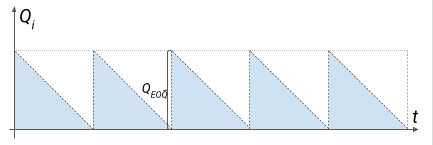
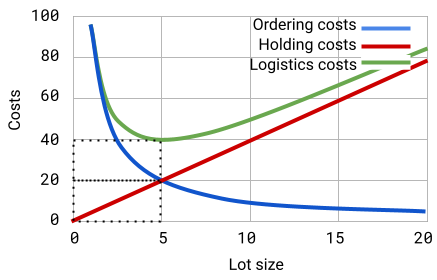
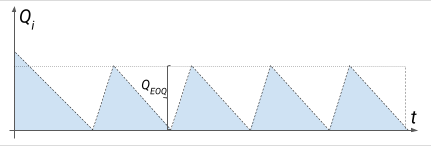

# Lot size decisions in supply planning. The economic quantity of the supply.

Versions: notes -[pdf](https://github.com/IgorBG/SCM/blob/main/source/lectures/lot_size_optimization/lot_size_optimization.pdf), [html](https://github.com/IgorBG/SCM/blob/main/source/lectures/lot_size_optimization/lot_size_optimization.html), [source](https://github.com/IgorBG/SCM/blob/main/source/lectures/lot_size_optimization/lot_size_optimization.md)

Model for the economic quantity to supply. Least Cost Per Period Model

Keywords: logistics costs, economic delivery quantity

The supply department ensures not only the timely provision of the business processes of an organization with the necessary commodity and material values. It also tries to optimize deliveries so that the enterprise incurs the smallest possible logistics costs. There are numerous activities that can reduce overall logistics costs. Here are a few of them:

a) combining deliveries and lots to optimize transport costs,

b) increasing the volume of the order to obtain discounts from manufacturers,

c) reduction of delivery volume to optimize warehouse costs,

d) "stratification" of supplies between several suppliers,

e) teaming up with other players for joint supplies,

e) others.

## Buying strategies

2 main strategies are used to solve the task of quantities and frequency of purchase:

Fig. 1. Small (a) and large (b) batch replenishment strategy

Strategy 1: More frequent deliveries of smaller quantities (a)

Strategy 2: Less frequent deliveries of larger quantities (b)

$$ SS = 0 $$

$$ \bar d_1=\bar d_2 $$

$$ T_{d1} < T_{d2} $$

$$ Q_1 < Q_2 $$

The advantages of Strategy 1:

- Less funds are required to purchase and maintain inventory

- Less investment to build storage capacity

Disadvantages of Strategy 1:

- Higher costs are required to manage, organize supplies

- Difficulties in negotiating small-volume, more frequent deliveries at attractive prices

- Higher cost of transporting the stock

- Greater uncertainty of the process, due to the short reaction time.

## Models for supply optimization under variable consumption.

### Economic Order Quantity (EOQ) Model

Also known as Wilson's formula. Shows quantity	of items in the lot, keeping logistics costs to a minimum.

EOQ - Economic Order Quantity

Q(EOQ) - optimal delivery quantity

$$ Q_{EOQ}=\sqrt{\frac{2\cdot A\cdot D}{r\cdot V}} $$

The model offers the optimal amount to purchase under the specified conditions. At this quantity, the costs of fulfilling the order and costs of owning the stock together form a minimum amount.

The minimum cost point falls at such a supply quantity where the cost of application equals the cost of holding.

**Total logistics costs at Q(EOQ).** 

For the EOQ model, there is an abbreviated formula for total logistics costs. With it, you do not need to calculate Q in advance. It shows the level of logistics costs that can be achieved if the economic quantity is ordered.

$$ TLC_{EOQ}=\sqrt{2\cdot A\cdot D\cdot r\cdot V} $$

#### Limits.

The classical model makes many assumptions to offer a simple solution. In practice, most parameters are not constant and have complex dependencies. For example:

- The price depends on the ordered quantities

- Fixed costs cease to be fixed when a change in quantities is significant

- Other fixed delivery costs apply when changing supplier

- The enterprise may use a combination of the delivery methods for the same item within one delivery

- A delivery can be made in even smaller portions

- The delivery may be a combination of the goods ordered

- Cost of ownership can vary greatly and given some other conditions

- The consumption of SKU is usually variable in nature

- Does not take into account the warranty stock (although it does not affect the size of the economic delivery quantity)

For these and other reasons, numerous modifications of the EOQ model exist. They overcome individual limitations and expand the spheres of its application.

### Incremental replenishment model

Part of the stock may be consumed while the material itself is being replenished in the warehouse. Under these conditions, it is necessary to adjust the order quantities so that after replenishing the stock and partially withdrawing it for production needs, sufficient quantities remain to cover the upcoming consumption.

The model looks like this:

$$ Q_{EOQ}=\sqrt{\frac{2\cdot A\cdot D}{r\cdot V}\cdot(\frac{n}{n-m})} $$

n - SKU production volume within the period

m - SKU consumption volume within the period

### Optimum quantity model with discounts available for larger quantities

Often suppliers offer significant discounts off the regular price if we order over a certain quantity. A procurement specialist must decide whether to order more and take a discount, or to give up. A supplier may offer many price tiers. Purchasing the larger quantity will reduce fixed costs per unit of output, but will increase holding costs. In some cases, the increased cost of ownership of the larger volume of production may outweigh the benefit of the discount. In the previous models, we ignored the cost of purchasing the material itself. There, within the considered period, we buy the same amount of materials at the same price. That's why*TMC* had no impact on total costs. In this case*TMC *it will be different because the price changes because of the discount.

The classic EOQ model cannot cover the task condition due to 2 features:

- We have 2 different prices that change when crossing a certain threshold.

- The model does not take into account the difference in the total cost of purchasing the materials with and without the discount

Let the threshold level of quantities at which he gives a discount be called Q(1). Then below this level the base price (without discount) will apply. Let's call her V(0). If we exceed the quantity Q(1), the price V(0) will be reduced by some discount (let it be _d_). A discounted price will be made up V0*(1-d)

The same can be represented by a system of equations:

$$
V = \begin{cases}
 & V_{0} \qquad \qquad 0 \leq Q \leq Q_{1} \\ 
 & V_{0} (1-d) \qquad Q_{1} \leq Q
\end{cases}
$$

The reduced price will also reduce the cost of purchasing the material. To account for these costs in our formulas, they will look like this. At the base price level (below the discount threshold: 0<Q<Q~1~), the total costs are equal to:

$$ TC=\frac{D}{Q}\cdot A+\frac{Q}{2}\cdot V_0\cdot r+D\cdot V_0 $$

If the quantities exceed the requirements for taking the discount (Q~1~<Q<?), we adjust the price in the formula:

$$ TC=\frac{D}{Q}\cdot A+\frac{Q}{2}\cdot V_0\left(1-d\right)\cdot r+D\cdot V_0\cdot(1-d) $$

As you can see here, we have added the third component - the total cost of the materials.

#### Algorithm for solving the task of accepting or rejecting a discount offer:

By comparing the total costs we can say for sure whether the discount is profitable and, respectively, whether we should change the purchase plan.

Step 1. We calculate Q~EOQ ~at a discounted price:

$$ Q_{EOQ\left(disc\right)}=\sqrt{\frac{2\cdot A\cdot D}{r\cdot V_0\cdot\left(1-d\right)}} $$

Step 2. We compare the optimal amount with the amount required for a discount

Q(EOQ(disc)) <=> Q(1)

If Q(EOQ(disc)) ~ exceeds the required level to receive a discount, so we should accept it.

Step 3. We compare the total costs with and without discount.

We perform this step if Q~EOQ(disc)~ is below the discount level. Because of different potential levels of TMC, we should consider whether total costs would fall if we increased quantities to the discount level (Q~1~).

$$ TC=\frac{D}{Q}\cdot A+\frac{Q}{2}\cdot V_0\cdot r+DV_0 $$

Where Q = Q(EOQ) at price without discounts, or Q = initially given agreed quantity (depending on the task)

$$ TC=\frac{D}{Q}\cdot A+\frac{Q}{2}\cdot V_0\left(1-d\right)\cdot r+DV_0\cdot(1-d) $$

Where Q = Q(1)

## Models for supply optimization under variable consumption

In practice, 2 approaches are used to determine the order for variable consumption:

- Adapted Economic Order Quantity (EOQ) variants

- Balancing methods

An important point is the harmonization of indicators in the model. Thus, if the monthly or average monthly consumption indicators are used in the model - then the ownership cost rate must be on a monthly basis. If we use annual in the models

### Average level of the economic supply quantity

When consumption does not fluctuate very widely, one approach to dealing with variable demand is to ignore the variation and calculate supplies using the economic supply quantity.

$$ Q_{EOQ}=\sqrt{\frac{2\cdot A\cdot D}{V\cdot r}} $$

Working with the data for individual months we can use the average consumption and the monthly rate of cost of ownership. If we go into annual meters - we use total annual consumption and annual cost of ownership.

After receiving Q(EOQ) we follow the purchase plan. When the volume of planned consumption approaches the value of Q as much as possible EOQ, then a lot of that close quantity should be ordered.

### Economic delivery quantity expressed as order periods

If the consumption has a high variation - deliveries will be carried out very irregularly. There are situations where the procurement department prioritizes the rhythmicity of deliveries.

Using the economic quantity, we can work out how much supply per year we will have at that quantity - we divide the annual consumption by the economic quantity to supply: 

$$ D/Q_{EOQ} $$ 

Having the number of deliveries per year, we can calculate the monthly periodicity by dividing 12 months by the number of deliveries. You will get a result: how many months would economy deliveries take place.

This adapted formula will give the same result:

$$ T_{EOQ}=\sqrt{\frac{2\cdot A}{D \cdot V\cdot r}} $$

If you use the annual consumption figures and the annual cost of ownership in the formula - you will need to multiply the resulting value by 12 to get the monthly frequency.

### Batch by batch

Just the right amount is ordered for each period. In this way, the lowest cost of inventory ownership is achieved. This approach is not appropriate when ordering costs are high.

### Balancing methods

Explanation with an abstract example: one-way ticket between cities A to B costs 10 EUR. A combo ticket is also available. The passenger can choose - to buy one combo ticket or to buy 2 separate tickets. At the price of a ticket-combo = 20 EUR, both options are equal in terms of costs. If the price of a combo-ticket = 18 EUR, the distributed price of one ticket would be 9 EUR. Here it makes sense to buy the combo-ticket. If the price of one combo ticket is 21 EUR - it is reasonable to buy 2 separate tickets.

Another example: for a certain number of passengers, it may be advantageous to change different combinations of a car, minibus, bus, as well as combinations of several cars, or a combination of a minibus and a bus. Each combination can be valued and a decision made about its use for a specific number of passengers.

The idea of ??this class of methods is to compare the costs of two alternatives (to aggregate the lot or to deliver separately). The alternatives can be compared according to different characteristics - cost per period, cost per number, the balance of the two main components of logistics costs. This iterative comparison makes these methods suitable for supply optimization. Below we will look at 3 types of balancing methods.

### Lowest period costs

Individual batches are combined into one delivery, while their total logistics costs, distributed per unit of time, decrease.

If we only deliver for one period:

$$ LC_{(1)} = FC + HC_{(1)} $$

If the delivery includes periods 1 and 2:

$$ LC_{(1;2)} = FC + HC_{(1)} + HC_{(2)} $$

If the delivery includes n periods:

$$ LC_{(1;2;...;n)} = FC + HC_{(1)} + HC_{(2)} + ... + HC_{(n)} $$

Undoubtedly, the logistics costs covering 2 months (LC(1;2)) will be greater than the logistics costs covering only 1 month (LC(1)). But after dividing the combined delivery by the number of months - we get distributed logistics costs per month. If this spread out cost is smaller with more months included - we conclude that there is a benefit to increasing the scope of the batch.

$$ \frac{LC_{(n)}}{n} >  \frac{LC_{(n+1)}}{n+1} $$

$$ \frac{LC_{(n)}}{n} <  \frac{LC_{(n+1)}}{n+1} $$

### Lowest cost per unit of inventory

The logic for calculating logistics costs is the same as for lowest costs. The difference is that here the order periods are summed up to the point at which the cost per unit of inventory starts to rise.

If we only deliver for one period:

$$ LC_{(1)} = FC + HC_{(1)} $$

$$ TQ_{(1)} = Q_{(1)} $$

If the delivery includes periods 1 and 2:

$$ LC_{(1;2)} = FC + HC_{(1)} + HC_{(2)} $$

$$ TQ_{(1;2)} = Q_{(1)} + Q_{(2)} $$

If the delivery includes n periods:

$$ LC_{(1;2;...;n)} = FC + HC_{(1)} + HC_{(2)} + ... + HC_{(n)} $$

$$ TQ_{(1;2;...;n)} = Q_{(1)} + Q_{(2)} + ... + Q_{(n)} $$

$$ \frac{LC_{(n)}}{TQ_{(n)}}>\frac{LC_{(n+1)}}{TQ_{(n+1)}} $$

$$ \frac{LC_{(n)}}{TQ_{(n)}}<\frac{LC_{(n+1)}}{TQ_{(n+1)}} $$

### Balancing between fixed and variable costs

The main criterion used in this model is to choose the number of periods covered by the supply so that the total cost of ownership is as close as possible to the cost of the order.

If we only deliver for one period:

$$ TFC_{(1)} = FC $$

$$ THC_{(1)} = HC_{(1)} $$

If the delivery includes periods 1 and 2:

$$ TFC_{(1;2)} = FC $$

$$ THC_{(1;2)} = HC_{(1)} + HC_{(2)} $$

If the delivery includes n periods:

$$ TFC_{(1;2;...;n)} = FC $$

$$ THC_{(1;2;...;n)} = HC_{(1)} + HC_{(2)} + ... +  HC_{(n)} $$

$$ TFC_n > THC_n $$

$$ TFC_n < THC_n $$

We appreciate how big the difference is between TFC and THC in the last 2 variants.

We stop at that option whereTFC and THC are closest to each other as values.

### Which method should we choose?

## Test
Please fill the test on the lecture material: [https://forms.gle/irWmpmx3vcWhHfoe6](https://forms.gle/irWmpmx3vcWhHfoe6)

## Discussion

